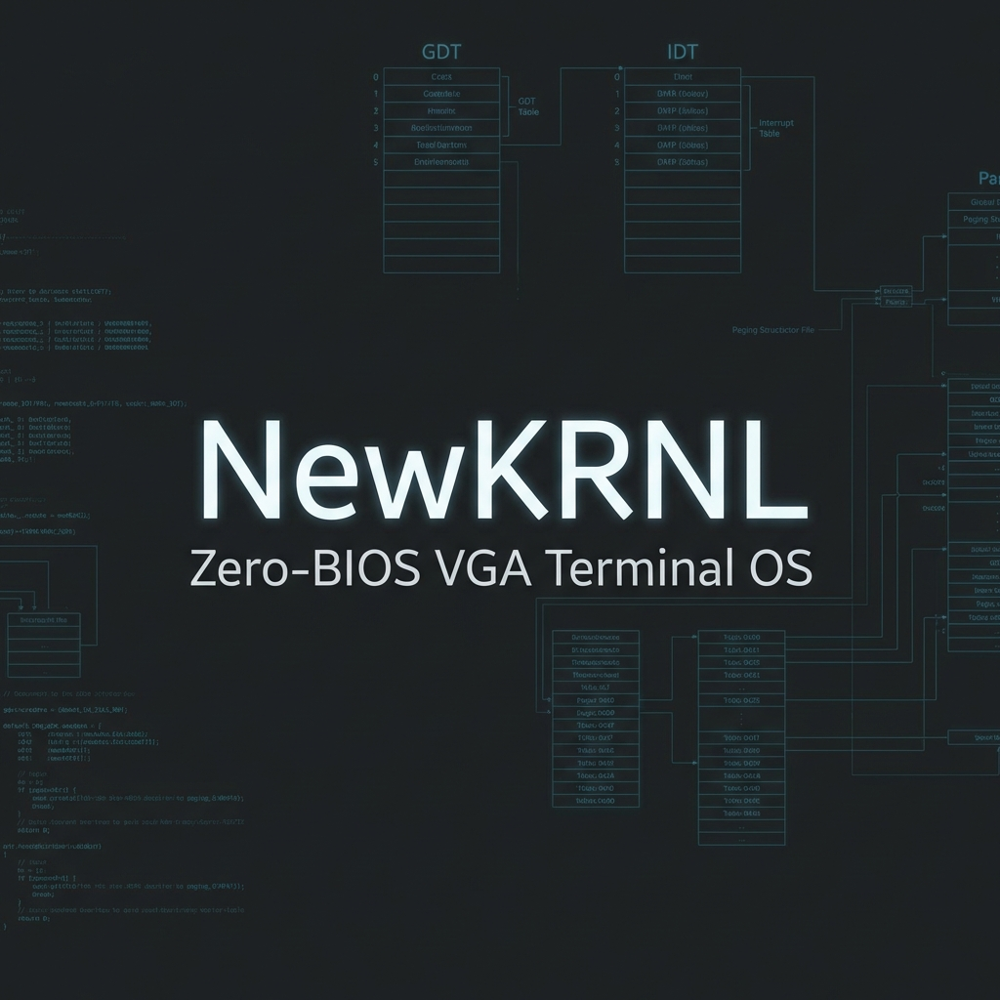

# NewKRNL Zero-BIOS Terminal OS

A robust, high-performance x86 operating system built from scratch with a "Zero-BIOS" architecture. After the initial boot, the kernel takes full control of the hardware using native 32-bit drivers, bypassing legacy BIOS interrupts.

## 🚀 Features

- **Zero-BIOS Core**: Native 32-bit Protected Mode, GDT, IDT, and Paging.
- **VGA Terminal**: Full 80x25 text mode terminal with hardware cursor support and ANSI-inspired colors.
- **Boot Setup**: Interactive first-boot interview for username and timezone configuration.
- **RAMFS**: Lightweight in-memory file system.
- **Command Suite**: Full UNIX-like utilities (`ls`, `mkdir`, `cat`, `rm`, `cd`) + system tools (`reboot`, `shutdown`, `sysinfo`).
- **Interactive Shell**: Responsive, interrupt-driven TTY with prompt customization.
- **Easter Eggs**: Includes a playable Snake game!

## 🛠️ Build & Run

### Prerequisites
- `gcc` (i386-elf or native with -m32)
- `nasm`
- `make`
- `qemu-system-i386`

### Running the OS
```bash
make run
```

## 📂 Project Structure
- `boot.asm`: 16-bit to 32-bit stage bootloader.
- `kernel.c`: Main kernel entry point.
- `drivers/`: Native hardware drivers (VGA, Keyboard, PIT, Serial).
- `system/`: Core OS modules (VFS, Shell, Paging, CPU management).

## 🐚 Snapshot


---
*Built with ❤️ for standard-compliant low-level enthusiasts.*
